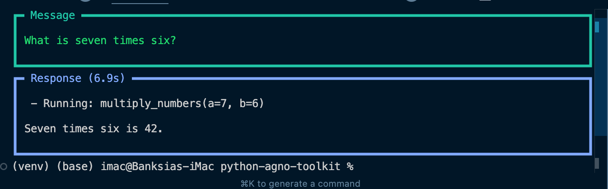
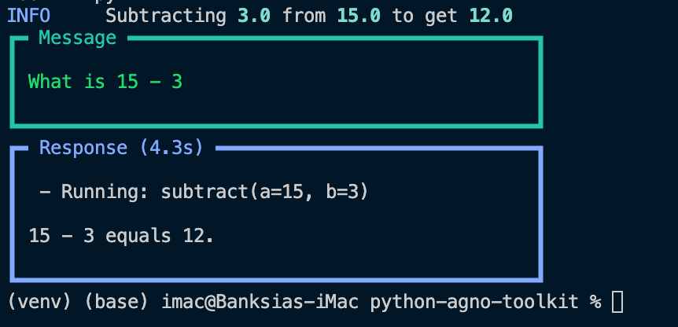

# Function Toolkit for Agno ⚙️




[](https://www.python.org/)
[](https://opensource.org/licenses/MIT)
[](https://github.com/psf/black)
[](https://github.com/yourusername/function-toolkit)

## 📖 Overview

A comprehensive toolkit for mathematical operations and function testing, inspired by [Jie Jenn's tutorial on Creating Your Own Tools](https://www.youtube.com/watch?v=WQymet7_mDg). This project provides a collection of utility functions and tools for enhanced development workflow.

## 🚀 Features

- Mathematical operations toolkit
- Function testing utilities
- Demo implementations
- Extensible architecture

## 🛠️ Tech Stack

-  Python 3.8+
-  Testing Framework
-  Version Control

## 🚦 Getting Started

1. Clone the repository:

```bash
git clone https://github.com/pakagronglb/function-toolkit-agno.git
```

2. Install dependencies:
```bash
pip install -r requirements.txt
```

3. Run the demo:
```bash
python function_tool_demo.py
```

## 💡 Usage

```python
from math_toolkit import MathToolkit
from test_toolkit import TestToolkit

# Math operations example
math_tools = MathToolkit()
result = math_tools.calculate_something()

# Testing example
test_tools = TestToolkit()
test_tools.run_tests()
```

## 🧪 Testing

Run the test suite:

```bash
pytest test_toolkit.py
```

## 📝 License

This project is licensed under the MIT License - see the [LICENSE](LICENSE) file for details.

## 🙏 Acknowledgments

- Special thanks to [Jie Jenn](https://www.youtube.com/watch?v=WQymet7_mDg) for the excellent tutorial on creating custom tools and toolkits
- Inspired by Agno AI Agent development practices

## 🤝 Contributing

1. Fork the repository
2. Create your feature branch (`git checkout -b feature/AmazingFeature`)
3. Commit your changes (`git commit -m 'Add some AmazingFeature'`)
4. Push to the branch (`git push origin feature/AmazingFeature`)
5. Open a Pull Request

## 📬 Contact

Pakagrong Lebel - [@pakagrong](https://github.com/pakagronglb)

Project Link: [https://github.com/pakagrong/function-toolkit-agno](https://github.com/pakagrong/function-toolkit-agno)

---
⭐️ From [Pakagrong Lebel](https://github.com/pakagronglb)

